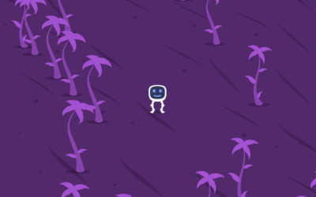

# Humwin & Darbold

For [js13kGames][js13kgames] 2021.
The theme was "Space".

Humwin, your friendly space exploring robot, is in search for his pal
Darbold, who has gone missing on a strange planet. What happened to him
and where is he?

Play the original submission [here][play].

Unfortunately, the game turned out to be too unforgiving and I failed to
make the solution clear. So here's a slightly improved [post-compo][post]
version.

Works on your phone, too.

## Build Requirements

[esbuild][esbuild] is used for minification. You can get it with `npm`:

	$ npm install --global esbuild

[js13kgames]: http://js13kgames.com/entries/2021
[play]: http://hhsw.de/sites/proto/js13k2021/
[post]: http://hhsw.de/sites/humwin
[esbuild]: https://github.com/evanw/esbuild
